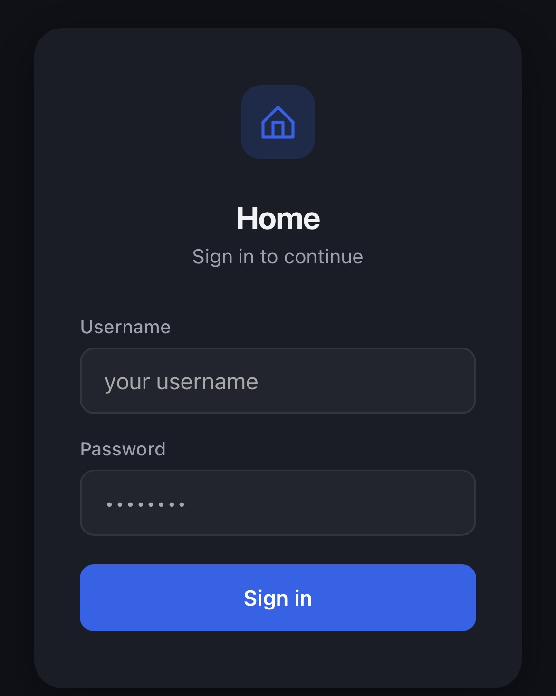
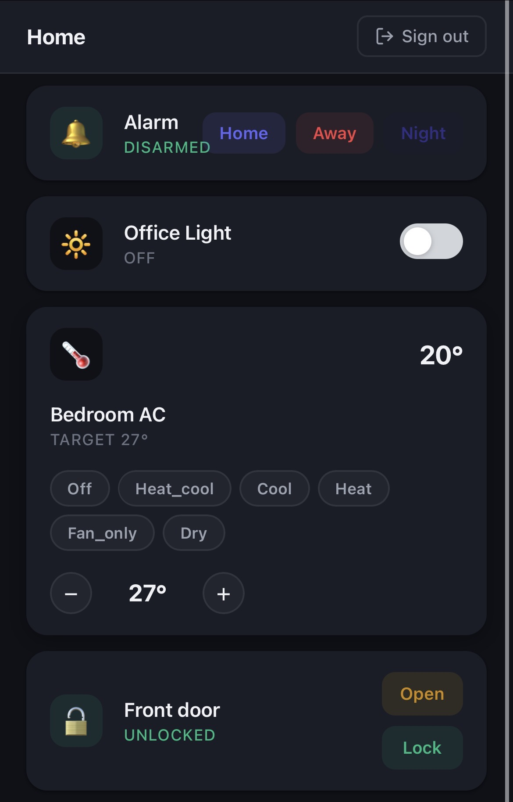
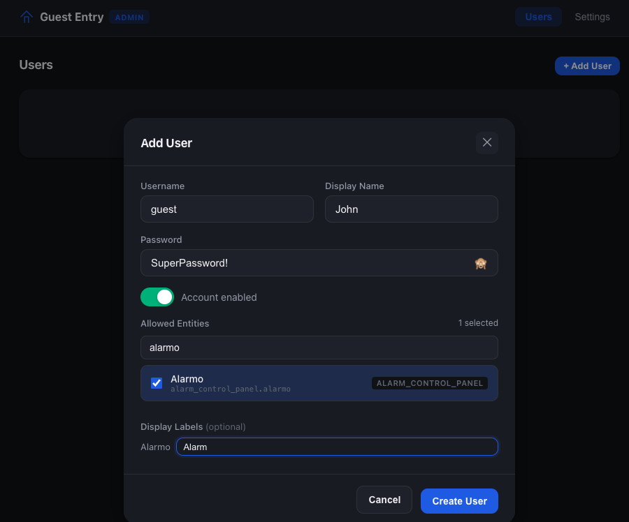
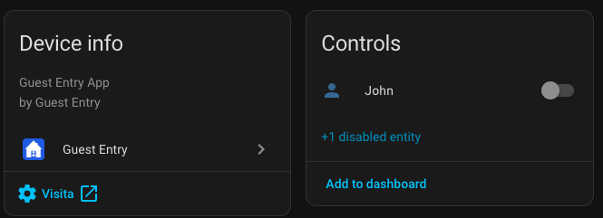
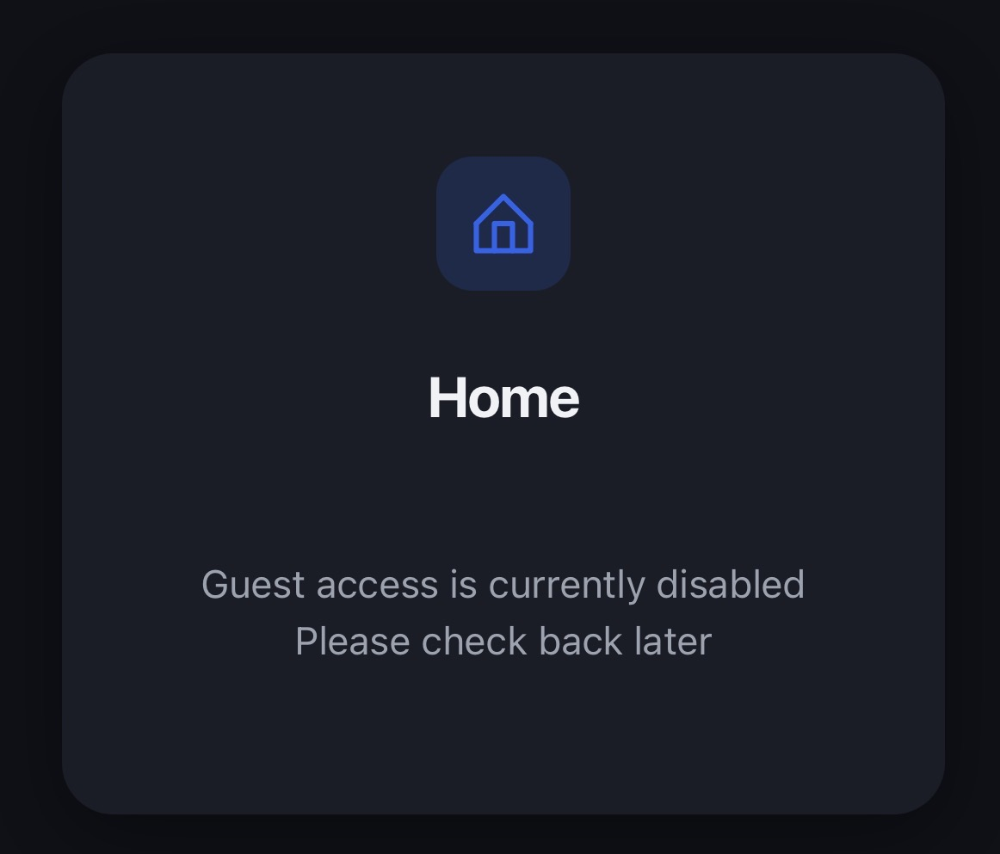

# Guest Entry for Home Assistant

[](https://www.home-assistant.io)
[](https://github.com/hacs/integration)

> This integration was built with help from [Claude](https://claude.ai).

A Home Assistant app and companion integration that gives guests controlled access to selected smart home devices — without sharing your HA credentials or exposing your full setup.

Guests get a simple, mobile-friendly dashboard to control only the entities you explicitly assign to them. You manage everything — users, permissions, and settings — from a secure admin panel accessible only through the HA ingress.

---

## Screenshots

| Guest Login | Guest Dashboard |
|-------------|-----------------|
|  |  |

| Admin — Add User | Admin — Integration (per-user access) |
|-----------------|--------------------------------------|
|  |  |

| Guest — Account Disabled |
|--------------------------|
|  |

---

## Features

- **Per-user access control** — create guest accounts and assign exactly which entities each user can control
- **Guest dashboard** — clean, mobile-friendly UI for lights, switches, covers, climate, locks, and alarm panels
- **Real-time state updates** — entity states update live via WebSocket without page refresh

---

## Supported entity types

| Domain | Supported actions |
|--------|------------------|
| `light` | On, Off, Brightness, Color temperature |
| `switch` | On, Off |
| `cover` | Open, Close, Stop, Position |
| `climate` | Set HVAC mode, Set temperature |
| `lock` | Lock, Unlock, Open |
| `alarm_control_panel` | Arm Home, Arm Away, Arm Night, Disarm (with optional code) |

---

## Requirements

- Home Assistant 2024.1 or later with Supervisor (Home Assistant OS or Supervised — required to run apps)
- [HACS](https://hacs.xyz/) for installing the companion integration (or install manually)

---

## Architecture

Guest Entry consists of two components that work together:

```
┌─────────────────────────────────────────────────────┐
│                  Home Assistant                      │
│                                                      │
│  ┌─────────────────┐     ┌────────────────────────┐  │
│  │  App            │     │  Companion Integration │  │
│  │  (Supervisor)   │◄────│  (custom_components)   │  │
│  │                 │     │                        │  │
│  │  :7980 Admin    │     │  Switch: Guest Access  │  │
│  │  (ingress only) │     │  Switch: per-user      │  │
│  │                 │     └────────────────────────┘  │
│  │  :7979 Guest UI │◄── guests (external)            │
│  └─────────────────┘                                 │
└─────────────────────────────────────────────────────┘
```

- The **app** runs two dashboards: the guest dashboard (port 7979, externally accessible) and the admin panel (port 7980, ingress only — never exposed)
- The **companion integration** connects HA automations to the app via an internal API, and exposes switch entities to control access

---

## Installation

### Step 1 — Install the app

**Add the repository to your app store:**

[](https://my.home-assistant.io/redirect/supervisor_add_addon_repository/?repository_url=https%3A%2F%2Fgithub.com%2Fandriensis%2Fha-guest-entry)

Click the button above, or add it manually:

1. In Home Assistant, go to **Settings → Apps → App Store**
2. Click the **three-dot menu** (top right) → **Repositories**
3. Paste `https://github.com/andriensis/ha-guest-entry` and click **Add**
4. Find **Guest Entry** in the store and click **Install**
5. After installation, go to the app's **Network** tab and set the guest port (default: `7979`). The admin port (7980) should be left unmapped — it is only accessible via HA ingress.
6. Start the app

### Step 2 — Install the companion integration via HACS

> **Prerequisites:** You need [HACS](https://hacs.xyz/) installed. If you don't have it yet, follow the [HACS installation guide](https://hacs.xyz/docs/use/download/download/) first.

**Add the repository to HACS:**

[](https://my.home-assistant.io/redirect/hacs_repository/?owner=andriensis&repository=ha-guest-entry&category=integration)

Click the button above, or add it manually:

1. Open **HACS** → **Integrations** → **⋮** (top right) → **Custom repositories**
2. Paste `https://github.com/andriensis/ha-guest-entry` as the URL
3. Select **Integration** as the category and click **Add**

**Download and install:**

1. In HACS, find **Guest Entry** in the integration list
2. Click **Download** and confirm
3. **Restart Home Assistant**

### Step 3 — Set up the integration

After restarting:

[](https://my.home-assistant.io/redirect/config_flow_start/?domain=ha_guest)

Or go to **Settings → Devices & Services → + Add Integration** and search for **Guest Entry**.

### Manual installation (without HACS)

1. Copy the `custom_components/ha_guest/` folder into your HA `config/custom_components/` directory
2. Restart Home Assistant
3. Add the integration via Settings → Devices & Services

---

## Setup

### Admin panel

Once the app is running, open it by clicking **Open** in the app page (or via the HA sidebar if you pin it). This opens the admin panel through HA ingress.

From the admin panel you can:

- **Users** — create guest accounts, set a username and password, enable/disable the account, and assign allowed entities
- **Settings** — set the instance name shown on the guest login page, configure session duration and brute-force limits, and toggle global guest access

### Adding a guest user

1. Go to the **Users** tab in the admin panel
2. Click **Create User**
3. Enter a username and password
4. Select which entities the guest can control from the entity picker
5. Optionally set a **display label** for each entity — this is shown on the guest dashboard instead of the HA entity name
6. Save

### Guest dashboard

Guests access the dashboard at `http://your-ha-address:7979` (or whatever port you configured). They log in with the credentials you created and see only their assigned entities.

---

## HA entities created by the integration

| Entity | Type | Description |
|--------|------|-------------|
| `switch.guest_entry_<username>` | Switch | Enables or disables access for an individual guest user |

These switches can be used in automations — for example, to automatically disable a guest's access after their stay or enable it only on specific days.

---

## Automation example

### Disable a guest's access after their stay

```yaml
automation:
  alias: "Disable guest after checkout"
  trigger:
    - platform: time
      at: "12:00:00"
  condition:
    - condition: date
      after: "2025-06-15"
  action:
    - service: switch.turn_off
      target:
        entity_id: switch.guest_entry_mario
```

### Enable access only on weekends

```yaml
automation:
  alias: "Enable guest on weekends"
  trigger:
    - platform: time
      at: "00:00:00"
  action:
    - service: >
        switch.turn_onswitch.turn_off
      target:
        entity_id: switch.guest_entry_mario
```

---

## Security

The guest dashboard is designed to be safe to expose externally. Here is what is in place:

- **JWT authentication** — every API request requires a signed token issued at login. Tokens expire automatically (default: 24 hours).
- **bcrypt passwords** — guest passwords are hashed with bcrypt (cost 12). Plaintext passwords are never stored.
- **Brute-force protection** — IPs are locked out after repeated failed logins, with progressive delays. HA sends a notification when a lockout occurs.
- **Per-request access check** — every API call re-validates that the user account is still enabled. Disabling a user's HA switch cuts off access immediately, including any active sessions.
- **Entity allow-list enforced server-side** — guests can only read or control entities explicitly assigned to them. They cannot enumerate or call services on other entities.
- **Action whitelist** — even for allowed entities, only a fixed set of safe actions is accepted per domain (e.g. `turn_on`, `lock`). Arbitrary HA service calls are not possible.
- **CORS blocking** — the API rejects cross-origin requests, preventing other websites from making calls on behalf of a logged-in guest.
- **Security headers**
- **Admin panel never exposed** — the admin panel runs on a separate port accessible only through HA ingress. It is never reachable from outside your network.
- **HTTPS recommended!** — if the guest dashboard is directly exposed to the internet, place it behind a reverse proxy with HTTPS (e.g. Nginx, Caddy, or HA's built-in SSL). Without HTTPS, credentials travel in plaintext.

---

## Troubleshooting

- **Admin panel shows a blank page** — wait a few seconds for the app to start, then refresh. Check app logs for errors.
- **"Invalid handler specified" when adding integration** — make sure you restarted HA after installing the integration files.
- **Entities not appearing in the guest dashboard** — check that the user account is enabled and has at least one entity assigned.
- **State not updating in real time** — the guest dashboard uses WebSocket for live updates. If updates stop, refreshing the page will restore the connection.
- **Debug logs** — search for `ha_guest` in the logs: [](https://my.home-assistant.io/redirect/logs)

---

## Contributing

Pull requests are welcome. Please open an issue first for significant changes.

## License

MIT
